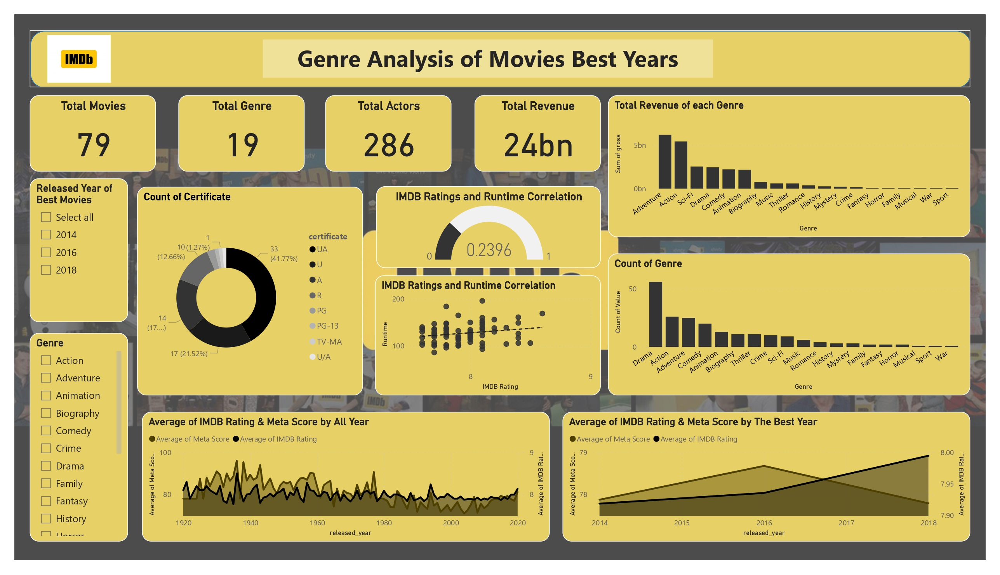

# Genre Analysis of Movie's Best Years

## Objective
This project aims to analyze which **genre is the best** and look for the genre that **follows trend**. It will involve using average IMDb ratings and Meta Scores to determine the year with the highest-rated movies, which is the **greatest released years** of movies and. Additionally, I will analyze sales data for each genre to identify which genre has consistently generated the highest sales. By merging insights from both user ratings and critic score, I want to get the information about the most successful movies based on trends and pinpoint the best genres that not only captivate audiences but also give significant impact in commercial success. This way, we can see what people like and what sells well, helping a movie company decide on the best genres for success.

## Data
I will explore the top 1000 Movies IMDB Rating with released year from 1920 to 2020. I search for the best years of movies so I can categorize the best movies with high quality. The database contains one table that consists of 16 columns. The source of dataset is from Kaggle. 

Data Source : https://www.kaggle.com/datasets/harshitshankhdhar/imdb-dataset-of-top-1000-movies-and-tv-shows

## Tools
- Microsoft Excel for data preparation and cleaning
- Jupyter Notebook for easy documentation 
- MySQL for Exploratory Data Analysis (querying, data manipulation, joining, and filtering).
- Power BI for data visualization

## Visualization
Here's the visualization of the project that I've made using Power BI.

## Closing
I appreciate your interest in my project repository. I am open to any feedback, suggestions, or critiques you want to give me as it will increase my documentation skills for my newer projects and my analytical skills on data.

Feel free to reach me out 

  - Email: findisel.joshua@gmail.com
  - Linkedin: https://www.linkedin.com/in/joshua-findisel-pangaribuan/
